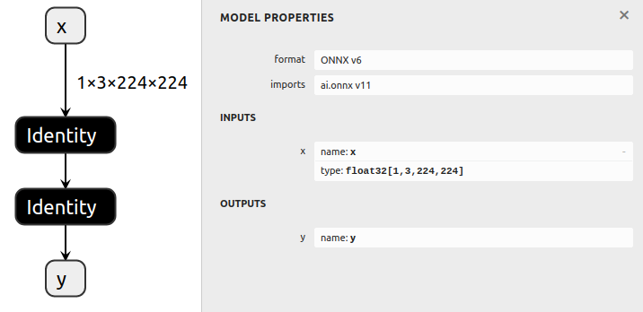

# Removing A Node

This example first generates a very basic model, and then removes a node in the
middle of the model, and reconnects the remaining nodes in the graph.

In order to remove a node, we replace the output tensors of its input node
with its own outputs, and then remove its own connection to its outputs.

For example, for a graph with the following structure:

     Node0
       |
    Tensor0
       |
     Node1
       |
    Tensor1
       |
     Node2
       |
    Tensor2

In order to remove `Node1`,
1. Change `Node0`'s outputs to `[Tensor1]` instead of `[Tensor0]`.
2. Change `Node1`'s outputs to `[]` instead of `[Tensor1]`

The resulting graph looks like this:

     Node0     
       |    
    Tensor1       Tensor0
       |             |
     Node2         Node1
       |
    Tensor2

Note that `Node1` remains in the graph.
This is easily remedied by running the `cleanup()` function.

## Running the example

1. Generate a model with several nodes and save it to `model.onnx` by running:
    ```bash
    python3 generate.py
    ```

    The generated model includes a couple identity layers and a fake node that will be removed.

    

2. Remove the fake node, and save it to `removed.onnx` by running:
    ```bash
    python3 remove.py
    ```

    
